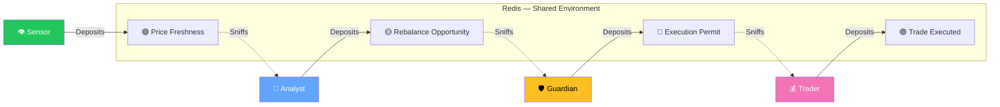

<p align="center">
  
</p>

<h1 align="center">DriftGuard</h1>

<p align="center">
  <strong>Autonomous Portfolio Stabilizer Powered by Swarm Intelligence</strong>
</p>

<p align="center">
  
  
  
  
  
</p>

---

## What Is DriftGuard?

DriftGuard is a **real-time portfolio rebalancing system** that keeps your investment allocation on target — automatically, safely, and without a central controller.

Instead of a traditional bot that follows rigid if/then rules (and crashes when something unexpected happens), DriftGuard uses **4 autonomous agents** that coordinate through "digital pheromones" — the same indirect communication method ants use to find food. Each agent operates independently: it wakes up when it detects a chemical signal, does its job, and goes back to sleep. No agent ever calls another agent directly.

**The key insight:** When market data becomes stale or unreliable, the pheromone signals naturally decay to zero — and the agents simply *stop acting*. The system doesn't crash, throw errors, or make bad trades. It gracefully hibernates until conditions improve.

> *"The beauty of the swarm is that no single agent knows what it's doing, yet the colony acts with profound intelligence."*

---

## How It Works

### The Problem: Fragile Orchestration

In a traditional system, a central "Manager" calls each step in sequence:

```
Manager → Fetch Price → Calculate Drift → Execute Trade
```

If *any* step hangs, times out, or returns bad data — the Manager crashes, retries blindly, or worse, executes trades on stale information. **This is fragile.**

### The Solution: Stigmergic Decoupling

In DriftGuard, **agents never talk to each other**. They don't even know other agents exist. Instead, they communicate indirectly through chemical signals (pheromones) stored in a shared Redis "Blackboard":



| Agent | What It Does | Wakes Up When |
|-------|-------------|---------------|
| **Sensor** | Fetches live market prices from Alpha Vantage | *Always active* (periodic cycle) |
| **Analyst** | Calculates how far the portfolio has drifted from target | `Price_Freshness` signal is strong (> 50%) |
| **Guardian** | Checks VIX volatility — blocks trades during market chaos | `Rebalance_Opportunity` signal is strong (> 50%) |
| **Trader** | Executes the actual buy/sell to rebalance | `Execution_Permit` signal is strong (> 80%) |

### The Safety Mechanism: Exponential Decay

Every pheromone decays over time following the formula:

```
I(t) = I₀ × e^(-λt)
```

This means:
- **If the API fails** → Sensor stops depositing → `Price_Freshness` decays to zero → Analyst never wakes up → **no bad trades**
- **If VIX spikes** → Guardian withholds `Execution_Permit` → Trader stays dormant → **portfolio protected**
- **If everything is healthy** → signals stay strong → agents coordinate seamlessly → **portfolio stays balanced**

---

## The Dashboard

The real-time dashboard at `localhost:3000` visualizes the entire swarm in action. Here's what each section means:

### 📊 System Health (Left Column)

Shows the 4 pheromone signals that drive the swarm. Each has:
- **Intensity bar** — How strong the signal currently is (0-100%)
- **Sparkline chart** — History of the signal over the last 20 readings
- **Category label** — Which stage of the pipeline this signal belongs to (Market Data → Drift Signal → VIX Check → Order Fill)

**What to watch for:** When all bars are high and green, the swarm is fully active. When they decay toward 0%, agents are going dormant — this is *by design*.

### 🐝 Swarm Intelligence (Left Column, Below)

A **pipeline visualization** showing the 4 agents as connected nodes:

```
Sensor → Analyst → Guardian → Trader
```

- **Colored borders** glow when the agent is active
- **Animated data packets** flow along the connectors showing pheromone transmission
- **OPs counter** shows how many actions each agent has performed

### 💰 Portfolio Status (Center Column)

The financial state of the portfolio:
- **Total Net Worth** — Current total value
- **Stocks / Bonds cards** — Individual asset values and allocation percentages
- **Allocation bar** — Visual split (green = stocks, blue = bonds)
- **Last Rebalance** — Timestamp of the most recent trade execution

### 📜 Trade History (Center Column)

Log of every rebalance trade the Trader agent has executed, showing:
- **Action** — BUY or SELL with amounts
- **Symbol** — Which asset (SPY, BND)
- **Drift delta (Δ)** — How much drift changed after the trade
- **Portfolio value** at time of execution

### 🎯 Drift Analysis (Center Column)

A **radial gauge** showing how far the current allocation has drifted from the target:
- **Green (ALIGNED)** — Drift ≤ 2%
- **Amber (MINOR DRIFT)** — Drift 2-5%
- **Orange (MODERATE DRIFT)** — Drift 5-10%
- **Red (CRITICAL DRIFT)** — Drift > 10%

Below the gauge, **comparison bars** show current vs target allocation for each asset, with a **white tick mark** indicating the target position.

### 📡 Event Stream (Right Column)

A real-time feed of every pheromone event in the system:
- **DEPOSITED** (green) — An agent deposited a new pheromone
- **SNIFFED** (blue) — An agent checked a pheromone level
- **DECAYED** (orange) — A pheromone has decayed below a threshold

**Filter buttons** at the top let you isolate specific event types. The footer shows `filtered / total` count.

### ⚙️ Settings Drawer

Click the **gear icon** in the header to open the Control Panel:
- **Target Allocation slider** — Adjust the stocks/bonds split the agents should maintain
- **Chaos Test button** — Simulates an API failure to demonstrate antifragile behavior
- **System Reset** — Returns the portfolio to default state

---

## 🚀 Getting Started

### Prerequisites
- **Redis** running on port 6379
- **Rust** 1.75+ and **Node.js** 20+
- **Alpha Vantage API key** (optional — runs in simulated mode without one)

### Quick Start

```bash
# 1. Clone
git clone https://github.com/yourusername/driftguard.git
cd driftguard

# 2. Configure (optional — leave blank for simulated market data)
cp .env.example .env
# Edit .env to add your ALPHA_VANTAGE_API_KEY

# 3. Start the backend
cargo run

# 4. Start the dashboard (in a new terminal)
cd dashboard
npm install
npm run dev
```

### Access Points
| Service | URL |
|---------|-----|
| **Dashboard** | [http://localhost:3000](http://localhost:3000) |
| **WebSocket** | `ws://localhost:8080/ws` |

---

## 🎮 Try the Chaos Test

This is the most powerful demo of DriftGuard's antifragile behavior:

1. **Launch both servers** — Watch the swarm come alive. Green bars rise, agents show active status.
2. **Open Settings** (gear icon) → Click **"Chaos Test"** — This simulates the Sensor's data feed going offline.
3. **Watch the cascade:**
   - `Price_Freshness` starts decaying (exponential — half-life ~3.5s)
   - Within seconds it crosses the threshold
   - Analyst goes dormant → Guardian goes dormant → Trader goes dormant
4. **Result:** The system has **self-stabilized into safe inaction** — no crashes, no error logs, no bad trades. Pure antifragility.

---

## 🛠️ Tech Stack

| Layer | Technology | Why |
|-------|-----------|-----|
| **Core Engine** | Rust + Tokio | Type safety, zero-cost async, speed |
| **Coordination** | Redis | Atomic operations, TTL for pheromone decay |
| **Dashboard** | React + Vite + Framer Motion | Real-time reactivity, smooth animations |
| **Market Data** | Alpha Vantage API | Free tier with simulated fallback |
| **Physics** | Custom (`src/core/physics.rs`) | `I(t) = I₀ × e^(-λt)` decay model |

## 📁 Project Structure

```
DriftGuard/
├── src/
│   ├── main.rs                 # Entry point — spawns all agents
│   ├── agents/
│   │   ├── sensor.rs           # Market data ingestion
│   │   ├── analyst.rs          # Drift calculation
│   │   ├── guardian.rs         # VIX circuit breaker
│   │   └── trader.rs           # Trade execution
│   ├── core/
│   │   ├── blackboard.rs       # Redis coordination layer
│   │   └── physics.rs          # Pheromone decay mathematics
│   ├── market/
│   │   └── alpha_vantage.rs    # Market data provider
│   └── server/
│       └── handler.rs          # WebSocket server for dashboard
├── dashboard/
│   ├── src/
│   │   ├── App.tsx             # Dashboard layout & wiring
│   │   ├── components/
│   │   │   ├── AgentStatus.tsx      # Agent network pipeline
│   │   │   ├── PheromoneMonitor.tsx  # Signal gauges + sparklines
│   │   │   ├── PortfolioBalance.tsx  # Portfolio metrics
│   │   │   ├── DriftChart.tsx       # Allocation vs target gauge
│   │   │   ├── TradeHistory.tsx     # Trade log
│   │   │   └── EventLog.tsx         # Filtered event stream
│   │   └── hooks/
│   │       └── useWebSocket.ts      # Real-time data connection
│   └── package.json
├── config.toml                 # Agent timing & thresholds
├── Cargo.toml
└── .env.example
```

## 📜 License

MIT License. Free to use, study, and fork.
