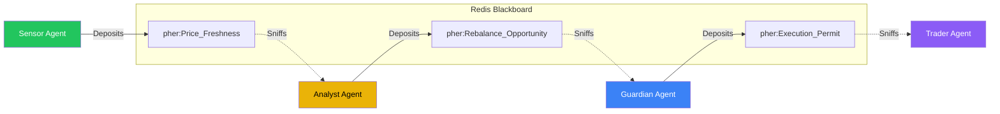

# 🐝 DriftGuard
> **Antifragile Swarm Intelligence for Autonomous Portfolio Management**


DriftGuard is a **stigmergic swarm system** that manages financial portfolios. Unlike traditional trading bots that rely on centralized orchestration (fragile), DriftGuard uses decentralized agents that coordinate indirectly through "digital pheromones" (antifragile).

**It is designed to fail safely by doing nothing when data becomes uncertain.**

---

## 💡 The "Why": Action-Based Stigmergy

Traditional systems ask: *"Is the API up? If yes, trade."*
DriftGuard asks: *"Is the pheromone signal strong enough to wake me up?"*

This subtle shift changes everything.

### 1. The Problem: Fragile Orchestration
In a standard system, a central "Manager" calls functions.
- "Fetch Price" → "Calculate Drift" → "Execute Trade"
- If "Fetch Price" hangs, the Manager crashes or hangs.
- If the Manager crashes, the whole system dies.
- **This is Fragile.**

### 2. The Solution: Stigmergic Decoupling
In DriftGuard, agents **never talk to each other**. They don't even know other agents exist.
- **Sensor Agent**: Wakes up, grabs data, deposits `Price_Freshness` pheromone. Dies.
- **Analyst Agent**: Sniffs air. If `Price_Freshness` > 50%, wakes up. Calculates drift. Deposits `Rebalance_Opportunity`. Dies.
- **Guardian Agent**: Sniffs air. If `Rebalance_Opportunity` > 70%, checks VIX. If safe, deposits `Execution_Permit`. Dies.

### 3. The Result: Antifragility
Because pheromones decay exponentially over time (`I(t) = I₀ × e^(-λt)`):
- **If the API fails:** The Sensor stops depositing.
- **The Result:** The `Price_Freshness` signal naturally decays to zero.
- **The Outcome:** The Analyst agent simply *never wakes up*.
- **The Safety:** No bad trades are made. No errors propagate. The system effectively "hibernates" during chaos.

---

## 🏗️ The Swarm Architecture

The system consists of 4 specialized, decoupled agents interacting via a Redis Blackboard.



| Agent | Responsibility | "Olfactory" Trigger |
|-------|----------------|---------------------|
| **Sensor** | Ingests market data (Alpha Vantage) | *Always Active* |
| **Analyst** | Calculates Portfolio Drift | `Price_Freshness` > 0.5 |
| **Guardian** | Panic Switch (VIX Volatility) | `Rebalance_Opportunity` > 0.5 |
| **Trader** | Executes Rebalance Orders | `Execution_Permit` > 0.8 |

---

## 🎮 Actionable Demo: The Chaos Test

DriftGuard includes a React Dashboard with a specialized **Chaos Test** button to demonstrate this behavior live.

1.  **Launch the System**: You see the "Swarm" active. Green bars (pheromones) are high. Agents are working.
2.  **Click "Chaos Test"**: This essentially "unplugs the internet" for the Sensor.
3.  **Watch the Decay**:
    *   `Price_Freshness` bar starts shrinking (exponential decay).
    *   Within 2.3 seconds (half-life), it crosses the threshold.
    *   **Analyst Agent** status switches to `DORMANT`.
    *   **Guardian Agent** status switches to `DORMANT`.
4.  **Safety Proven**: The system has self-stabilized into inaction without a single error log or crash.

---

## 🚀 Getting Started

### Prerequisites
*   Docker & Docker Compose
*   (Optional) Rust 1.75+ & Node.js 20+ for manual runs

### Quick Start (Docker)

```bash
# 1. Clone the swarm
git clone https://github.com/yourusername/driftguard.git
cd driftguard

# 2. Add your Alpha Vantage Key (or leave blank for demo mode)
echo "ALPHA_VANTAGE_API_KEY=your_key" > .env

# 3. Unleash the ants
docker compose up --build
```

### Access Points
*   **Dashboard**: [http://localhost:3000](http://localhost:3000)
*   **Redis Commander**: [http://localhost:8081](http://localhost:8081) (if enabled)

---

## 🛠️ Technology Stack

*   **Core Logic**: Rust (Tokio, Serde) - chosen for type safety and speed.
*   **Coordination**: Redis (The "Blackboard") - chosen for atomic operations and TTL.
*   **Visualization**: React + Vite (Tailwind, Framer Motion) - chosen for real-time responsiveness.
*   **Physics**: Custom Logic (`src/core/physics.rs`) implementing `I(t) = I₀ × e^(-λt)`.

## 📜 License

MIT License. Free to use, study, and fork.

---

> *"The beauty of the swarm is that no single agent knows what it's doing, yet the colony acts with profound intelligence."*
